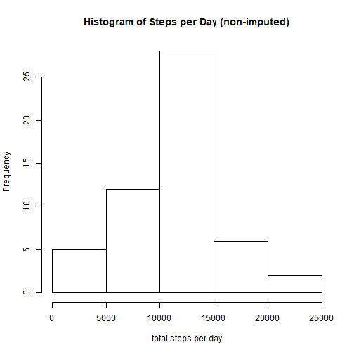
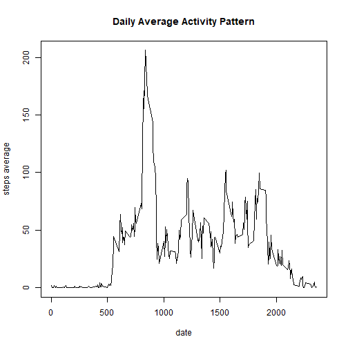
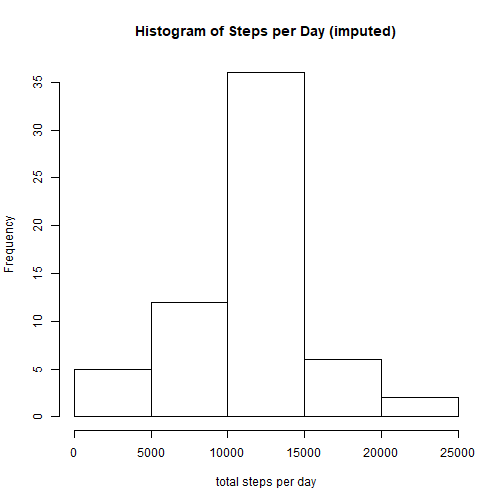

## Loading and preprocessing the data
- Load the data

```r
if(!exists("PAM")){
        PAM <- read.csv("activity.csv", na.strings = "NA")
}
```

The variables included in this dataset are:  

1. **steps**: Number of steps taking in a 5-minute interval (missing values are coded as `NA`)
2. **date**: The date on which the measurement was taken in YYYY-MM-DD format
3. **interval**: Identifier for the 5-minute interval in which measurement was taken

- Process/transform the data into a format suitable for your analysis.

It appears that the `date` column is not in the proper data format, so we must convert it to `date`.

```r
str(PAM)
```

```
## 'data.frame':	17568 obs. of  3 variables:
##  $ steps   : int  NA NA NA NA NA NA NA NA NA NA ...
##  $ date    : Date, format: "2012-10-01" "2012-10-01" ...
##  $ interval: int  0 5 10 15 20 25 30 35 40 45 ...
```

```r
PAM$date <- as.Date(PAM$date,"%Y-%m-%d")
```

## What is the mean total number of steps taken per day?
- Make a histogram of the total number of steps taken each day

```r
total_step <- aggregate(steps ~ date, data = PAM, sum, na.rm = T)
head(total_step)
```

```
##         date steps
## 1 2012-10-02   126
## 2 2012-10-03 11352
## 3 2012-10-04 12116
## 4 2012-10-05 13294
## 5 2012-10-06 15420
## 6 2012-10-07 11015
```

```r
par(mfrow=c(1,1))
hist(total_step$steps, main = "Histogram of Steps per Day (non-imputed)", xlab = "total steps per day")
```



- Calculate the **mean** and **median** number of steps taken each day

```r
mean(total_step$steps)
```

```
## [1] 10766.19
```

```r
median(total_step$steps)
```

```
## [1] 10765
```

## What is the average daily activity pattern?
- Make a time series plot (i.e. `type = "l"`) of the 5-minute interval (x-axis) and the average number of steps taken, averaged across all days (y-axis)

```r
mean_step_interval <- aggregate(steps ~ interval, data = PAM, mean, na.rm = T)
par(mfrow=c(1,1))
plot(mean_step_interval$interval, mean_step_interval$steps,
     main = "Daily Average Activity Pattern",
     xlab = "date",
     ylab = "steps average",
     type = "l")
```



- Which 5-minute interval, on average across all the days in the dataset, contains the maximum number of steps?

```r
max_step <- max(mean_step_interval$steps)
mean_step_interval$interval[mean_step_interval$steps==max_step]
```

```
## [1] 835
```


## Imputing missing values
Note that there are a number of days/intervals where there are missing values (coded as `NA`). The presence of missing days may introduce bias into some calculations or summaries of the data.

- Calculate and report the total number of missing values in the dataset

```r
PAM_complete <- PAM[complete.cases(PAM),]
nrow(PAM) - nrow(PAM_complete) # the difference is the number of rows with NAs (incomplete cases)
```

```
## [1] 2304
```

- Devise a strategy for filling in all of the missing values in the dataset.

The imputation strategy to be used will be **to fill in `NA` values with the mean for that particular 5-minute interval**.

- Create a new dataset that is equal to the original dataset but with the missing data filled in.

```r
PAM_imputed <- PAM # Copy the original data set
# Use the values from the `mean_step_interval` for filling in the values where the `steps` is `NA` and the `interval` matches
count = 0
for (i in 1:nrow(PAM)) {
        if (is.na(PAM$steps[i])) {
                PAM_imputed$steps[i] <- mean_step_interval[mean_step_interval$interval==PAM$interval[i], 2]
                count = count + 1
        }
}
cat(count, "NA values were successfully filled.\n\r")
```

```
## 2304 NA values were successfully filled.
## 
```


- Make a histogram of the total number of steps taken each day and Calculate and report the **mean** and **median** total number of steps taken per day. Do these values differ from the estimates from the first part of the assignment? What is the impact of imputing missing data on the estimates of the total daily number of steps?

```r
total_step2 <- aggregate(steps ~ date, data = PAM_imputed, sum, na.rm = T)
head(total_step2)
```

```
##         date    steps
## 1 2012-10-01 10766.19
## 2 2012-10-02   126.00
## 3 2012-10-03 11352.00
## 4 2012-10-04 12116.00
## 5 2012-10-05 13294.00
## 6 2012-10-06 15420.00
```

```r
par(mfrow=c(1,1))
hist(total_step2$steps, main = "Histogram of Steps per Day (imputed)", xlab = "total steps per day")
```



```r
mean(total_step2$steps)
```

```
## [1] 10766.19
```

```r
median(total_step2$steps)
```

```
## [1] 10766.19
```

The **mean** did not change since the imputed values used were averages

The **median** did not change significantly that could impact the actual estimates of location

## Are there differences in activity patterns between weekdays and weekends?

- Create a new factor variable in the dataset with two levels - "weekday" and "weekend" indicating whether a given date is a weekday or weekend day.

```r
for (i in 1:nrow(PAM_imputed)) {
        if (weekdays(PAM_imputed$date[i])=="Sunday" | weekdays(PAM_imputed$date[i])=="Saturday") {
                PAM_imputed$day_type[i] <- "weekend"
        }
        else {
                PAM_imputed$day_type[i] <- "weekday"
        }
}
PAM_imputed$day_type <- as.factor(PAM_imputed$day_type)
```

- Make a panel plot containing a time series plot (i.e. `type = "l"`) of the 5-minute interval (x-axis) and the average number of steps taken, averaged across all weekday days or weekend days (y-axis).

```r
steps_day_type <- aggregate(steps ~ interval + day_type, PAM_imputed, mean)
library(lattice)
xyplot(steps ~ interval | factor(day_type), data = steps_day_type, aspect = 1/2, type = "l")
```


**Yes, there are differences in activity patterns weekend vs weekdays.** Here are some observations:

- Higher average daily steps during weekdays at the 500-minute to 750-minute interval indicates that activities start earlier on weekdays compared to weekends.

- After the 750-minute interval mark, the amount of steps on weekends tend to stretch throughout the succeeding intervals until it declines at the 2200-minute mark.
